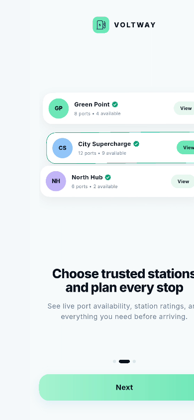

# VoltWay

<p align="center">
  <a href="./docs/voltway-demo.mp4">
    
  </a>
</p>

<p align="center">
  <a href="./docs/voltway-demo.mp4"><strong>▶ Watch the full app demo</strong></a>
</p>

VoltWay is a simple Flutter onboarding demo for an electric vehicle charging
station app. It focuses on a clean interface, reusable widgets, and smooth
animations without using a state management package.

## App flow

```text
Native Splash → Flutter Splash → Onboarding → Home
```

The onboarding is shown every time the app starts so the complete flow is easy
to test.

## Main features

- Dark native and Flutter splash screens
- Three light onboarding pages built with `PageView`
- Custom animated page indicator
- Smooth page entrance and floating animations
- Responsive layouts for different phone sizes
- Custom VoltWay SVG logo and launcher icon
- Local Inter font with multiple weights
- Simple navigation using Flutter `Navigator`

## Packages

- `flutter_svg` — displays the SVG logo inside the app
- `flutter_native_splash` — generates the Android and iOS splash screens
- `flutter_launcher_icons` — generates launcher icons for each platform

## Project structure

```text
lib/
├── main.dart
├── app.dart
├── core/
│   ├── theme/
│   │   └── app_theme.dart
│   └── widgets/
│       ├── app_logo.dart
│       └── gentle_float.dart
└── features/
    ├── splash/
    ├── onboarding/
    │   └── widgets/
    └── home/
```

Images, logos, icons, and fonts are stored in the `assets/` folder.

## Run the app

Install the dependencies:

```bash
flutter pub get
```

Run on a connected device or emulator:

```bash
flutter run
```

Run the checks:

```bash
flutter analyze
flutter test
```
